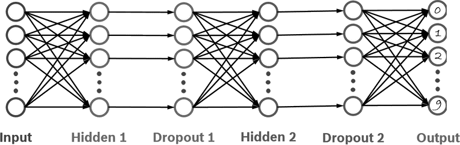
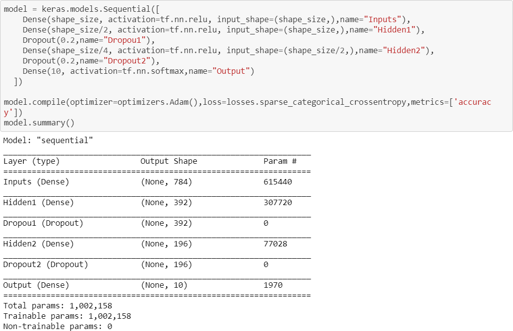

# TensorFlow_Mnist

THE MNIST DATABASE of handwritten digits
http://yann.lecun.com/exdb/mnist/

Tutorials and etc. https://www.tensorflow.org/tutorials/keras/classification

## Create,save and use model for mnist data set

We use simple Netural Network for this problem.

Coding using by Keras
